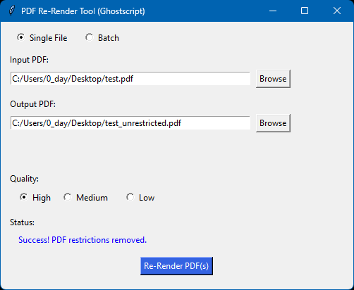
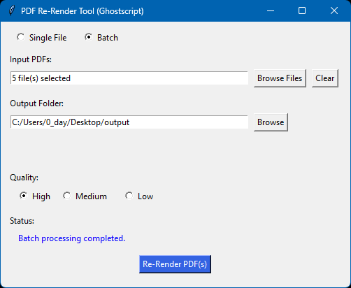

# PDF Re-Render

<!-- screenshots -->
 

A small GUI tool that re-renders PDF files using Ghostscript to remove restriction flags (printing/copying restrictions) by producing a new PDF output with pdf compression.

> Note: This tool does not bypass password-protected PDFs that require an owner/user password to open. If a PDF is encrypted with a user password, Ghostscript cannot bypass that.

**Prerequisites**
- Python 3.8 or newer
- Ghostscript installed on your system and available on `PATH` (the `ghostscript` Python package acts as a wrapper around the system Ghostscript binary)
  - Windows installers: https://ghostscript.com/releases/gsdnld.html
  - After installing on Windows, make sure the Ghostscript `bin` folder (e.g., `C:\Program Files\gs\gs##.##.#\bin`) is in your `PATH`.

**Dependencies**
- `ghostscript` (Python wrapper)
- `PyPDF2`

These are declared in `pyproject.toml` and can be installed via `pip`.

**Install dependencies (quick)**

PowerShell:

```powershell
python -m pip install --upgrade pip
pip install ghostscript PyPDF2
```

Or, if you prefer to install from the provided `requirement.txt`:

```powershell
pip install -r .\requirement.txt
```

**Run the GUI**

From the project root run:

```powershell
python .\main.py
```

The app provides two modes:
- Single file: select an input PDF and an output path.
- Batch mode: select multiple PDFs and an output folder.

Choose quality (High/Medium/Low) before re-rendering.

**Packaging**

To build a wheel or sdist (requires `build`):

```powershell
pip install build
python -m build
```

**Build Executable**

To package this app in a single `.exe` (requires `pyinstaller`):

```powershell
pyinstaller --onefile --windowed --noconsole main.py
```

**Troubleshooting**
- If Ghostscript isn't installed or not on `PATH`, the `ghostscript` Python wrapper will raise errors at run-time — install Ghostscript and add its `bin` directory to your system `PATH`.
- The tool will fail on PDFs that require a password to open (not just restricted PDFs). The app checks for encryption and alerts the user.

**License**

This project is licensed under the [MIT License](LICENSE)
